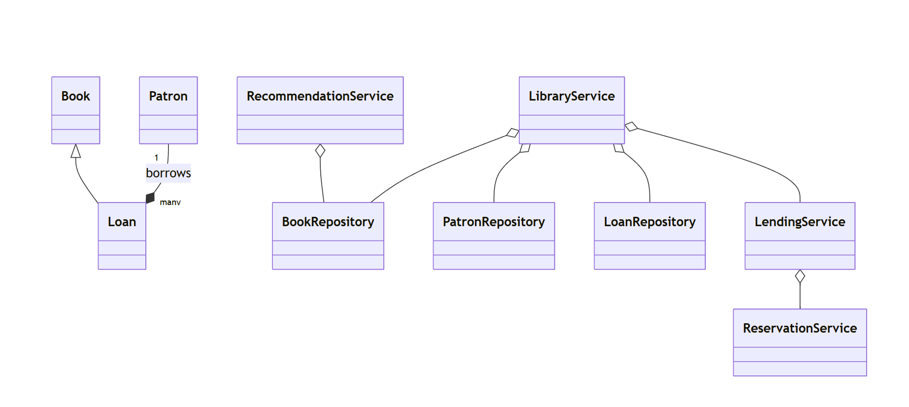

# Library Management System (Java)

This project is a simple in-memory Library Management System demonstrating OOP, SOLID principles, and design patterns.

Features implemented:
- Book management (add, remove, search)
- Patron management (add, borrowing history)
- Lending (checkout, return)
- Reservation system (Observer-like notification)
- Basic recommendation engine (based on borrow history)

Class diagram (Mermaid):

See `src/main/java/org/example/library` for source code.
